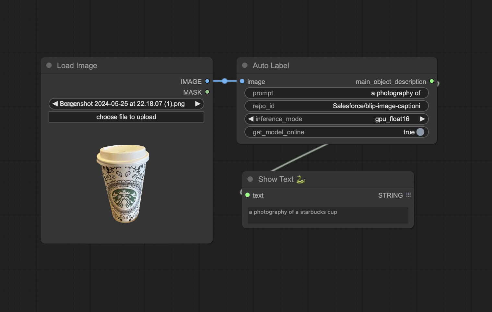

# ComfyUI-AutoLabel

ComfyUI-AutoLabel is a custom node for [ComfyUI](https://github.com/comfyanonymous/ComfyUI) that uses BLIP (Bootstrapping Language-Image Pre-training) to generate detailed descriptions of the main object in an image. This node leverages the power of BLIP to provide accurate and context-aware captions for images.



## Features

- **Image to Text Description**: Generate detailed descriptions of the main object in an image.
- **Customizable Prompts**: Provide your own prompt to guide the description generation.
- **Flexible Inference Modes**: Supports GPU, GPU with float16, and CPU inference modes.
- **Offline Mode**: Option to download and use models offline.

## Installation

1. **Clone the Repository**: Clone this repository into your `custom_nodes` folder in ComfyUI.

    ```bash
    git clone https://github.com/fexploit/ComfyUI-AutoLabel custom_nodes/ComfyUI-AutoLabel
    ```

2. **Install Dependencies**: Navigate to the cloned folder and install the required dependencies.

    ```bash
    cd custom_nodes/ComfyUI-AutoLabel
    pip install -r requirements.txt
    ```

## Usage

### Adding the Node

1. Start ComfyUI.
2. Add the `AutoLabel` node from the custom nodes list.
3. Connect an image input and configure the parameters as needed.

### Parameters

- `image` (required): The input image tensor.
- `prompt` (optional): A string to guide the description generation (default: "a photography of").
- `repo_id` (optional): The Hugging Face model repository ID (default: "Salesforce/blip-image-captioning-base").
- `inference_mode` (optional): The inference mode, can be "gpu_float16", "gpu", or "cpu" (default: "gpu").
- `get_model_online` (optional): Boolean flag to download the model online if not already present (default: True).

## Contributing

Contributions are welcome! Please open an issue or submit a pull request with your changes.

## License

This project is licensed under the MIT License.

## Acknowledgements

- [ComfyUI](https://github.com/comfyanonymous/ComfyUI)
- [BLIP](https://huggingface.co/Salesforce/blip-image-captioning-base)

## Contact

For any inquiries, please open an issue on the [GitHub repository](https://github.com/fexploit/ComfyUI-AutoLabel).
